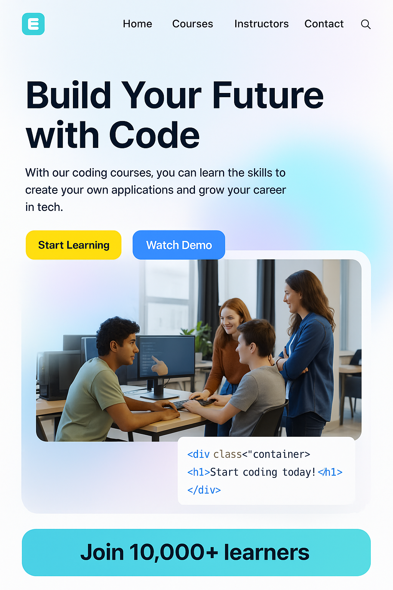

# <h1>📘 EdTech MERN Stack Online Learning Platform<h1>

 

An advanced full-stack **MERN** online learning platform — inspired by platforms like StudyNotion and Udemy — allowing **students**, **instructors**, and **admins** to seamlessly interact with educational content.

---

## 🚀 Features

### 👩‍🎓 For Students
- 🌟 Browse and purchase courses  
- 🧾 Wishlist and cart management  
- 🎥 Access video lessons & downloadable resources  
- ⭐ Rate and review courses  
- 🔐 Secure login/signup with JWT  

### 👨‍🏫 For Instructors
- 📚 Create, update, and manage courses  
- 📈 View course insights (views, ratings, feedback)  
- 🧾 Upload course media via Cloudinary  
- 💰 Set pricing and manage content  

### 👑 For Admins *(future scope)*
- 👥 Manage students & instructors  
- 🛠 Platform analytics and insights  
- 🚨 Instructor/course moderation  

---

## 🛠 Tech Stack

### Frontend
- ⚛️ ReactJS + TailwindCSS  
- 🧠 Redux Toolkit (State Management)  
- 🧭 React Router DOM  
- 📝 Formik + Yup (Form validation)  

### Backend
- 🟩 Node.js + Express.js  
- 🍃 MongoDB + Mongoose  
- 🔐 JWT + Bcrypt (Authentication)  
- ☁️ Cloudinary (Image/Video Uploads)  
- 💳 Razorpay (Payment Gateway Integration)  

---

## 🌐 API Design

RESTful API routes include:

- 🔐 **Auth Routes** → `/api/auth`  
- 📚 **Courses** → `/api/courses`  
- ⭐ **Ratings & Reviews**  
- 🛒 **Cart, Wishlist & Orders`**  

---

## 🔧 Deployment Details

| Part     | Service          |
|----------|------------------|
| Frontend | Vercel           |
| Backend  | Render / Railway |
| DB       | MongoDB Atlas    |
| Media    | Cloudinary       |

---

## 📌 Note

This project is still evolving. Admin dashboard and advanced analytics are in progress. PRs and ideas are welcome!

---

## ⭐ Star this repo if you like it!

